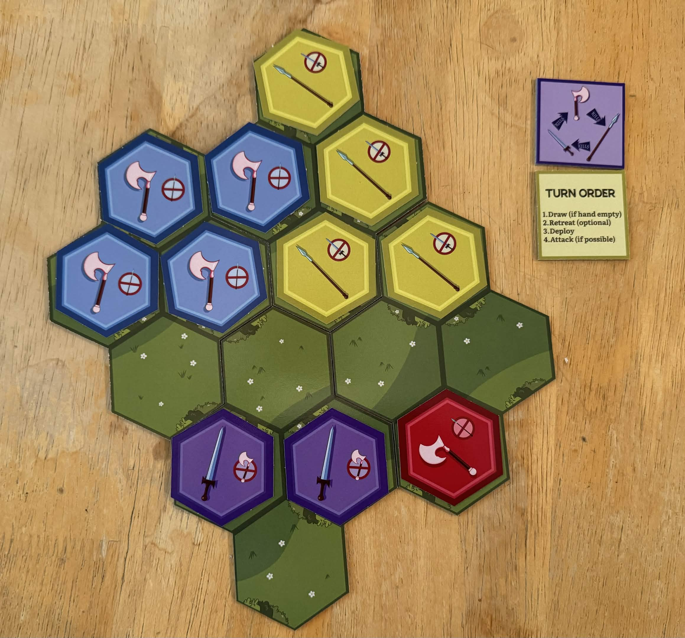

Sharing some progress on the board game I'm designing! This game has been almost 7 years in the making, with my first recorded iterations starting in 2019. In the [rules doc](https://docs.google.com/document/d/1LOGjD71TAOg6eka8LJ0YQiMUDCNQFQuq7egxFahBkS0/edit?tab=t.0 "Google Doc with rules to A Better Blade"). Alongside the rules, I've recorded the evolution of every change to the rules, and explanations for the intended effect of each - 48 unique days of updates so far, each of which containing several meaningful changes to the game.

The result of all this iteration is, in my opinion, a clever tactical game in which 2 to 4 players will continually outmatch the others by deploying armies that exploit the others' weaknesses. Each player is trying to conquer four out of the many castles on the board, and do everything it takes to stop the others from doing the same.

This game is played on a modular hexagonal board made by the players, with a unique geometry each game.

The core of the game is the weapon triangle: Spears beats Swords, Swords beats Axes, Axes beats Spears. In order to destroy an opponent's units, you'll need to assemble a group larger than theirs, of the type of weapon that beats theirs (with an attacking group of 4+ being counted as larger).

For example, in the scenario below, Purple has two swords next to Red's one axe. 2 > 1 and swords defeat axes, so purple can destroy red's axe. And Blue has four axes next to Yellow's 4 spears. Since axes defeat spears, and a group of 4 attackers is always considered larger, Blue can destroy Yellow's spears one by one.

This weapons triangle makes for a constantly shifting landscape where your soldiers have very decisive victories and losses.

If you're interested, you can play this game virtually on [Tabletop Simulator](https://steamcommunity.com/sharedfiles/filedetails/?id=2223886773)! This game is still in development, so any feedback is appreciated.
